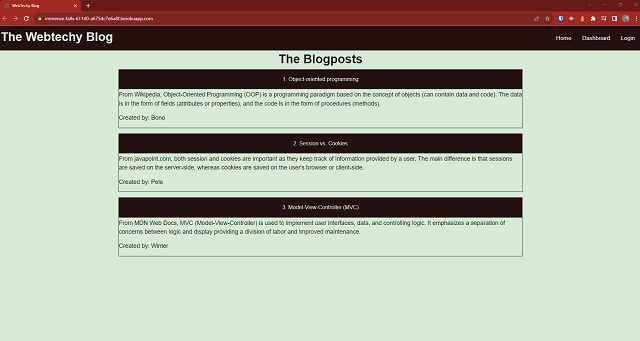
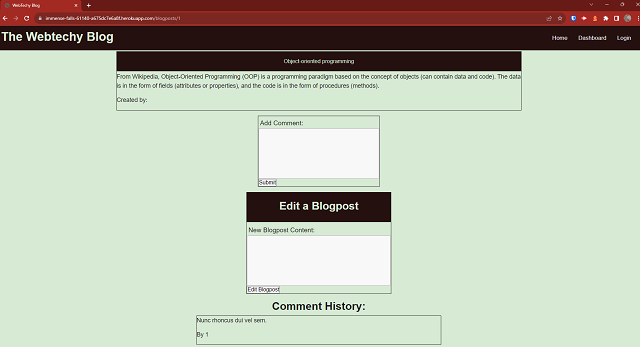
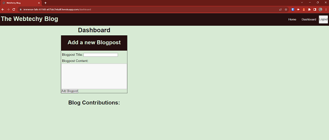

# Webtechy Blog

 

## Table of Contents
  - [Description](#description)
  - [Installation](#installation)
  - [Usage](#usage)
  - [Contributing](#contributing)
  - [License](#license)
  - [Questions](#questions)

## Description
Deployed Heroku site for submission:
[The Webtechy Blog](https://immense-falls-61140-a675dc7e6a8f.herokuapp.com/)

The importance of technology blogs cannot be overlooked as they can enhance the understanding of the less experienced developers to seasoned veterans. These blogs can fulfill these learning enhancements whether by reading them or contributing to writing blogposts and commenting on published blogposts.

This project and challenge is to build a blog site where future and current developers can publish their blog posts and comment on other posts as well. This project utilizes the Model-View-Controller (MVC) structure, utilizing handlebars for the viewing templates , sequelize as the ORM, and the express-session npm package for authentication.

This is my attempt to fulfill the acceptance criteria for the blog site. While some functionality needs improvement, this project, while very challenging, brought about great learning outcomes.

## Installation
The following npm packages were used in this project:
 - bcrypt: 5.1.0
 - connect-session-sequelize: 7.1.7
 - dotenv: 16.1.4
 - express: 4.18.2
 - express-handlebars: 7.0.7
 - express-session: 1.17.3
 - mysql2: 3.3.5
 - sequelize: 6.32.0

## Usage
The local application is invoked by first sourcing the mysql schema. Then, by running npm run seeds, the database was given initial data. Finally npm start runs the application accessible on a specified lcoal port.

## Contributing
Hat tip goes to

Class notes and examples to build and configure routes and controllers.

To help in the understanding of routing and controllers, two video tutorials were especially helpful:
 - [MVC Model-View-Controller Example | CRUD REST API | Node.js & Express tutorials for Beginners](https://www.youtube.com/watch?v=Dco1gzVZKVk) by Dave Gray.
 - [Node.js Crash Course Tutorial](https://www.youtube.com/watch?v=zb3Qk8SG5Ms&list=PL4cUxeGkcC9jsz4LDYc6kv3ymONOKxwBU&index=1) by Net Ninja.

## License
MIT License
A short and simple permissive license with conditions only requiring preservation of copyright and license notices. Licensed works, modifications, and larger works may be distributed under different terms and without source code. Please refer to [License: MIT](https://choosealicense.com/licenses/mit/) for more information.

## Questions
My GitHub username is leesochay and you can link to my profile at https://github.com/leesochay.  
For any questions, please feel free to email me at sochaylee@gmail.com
